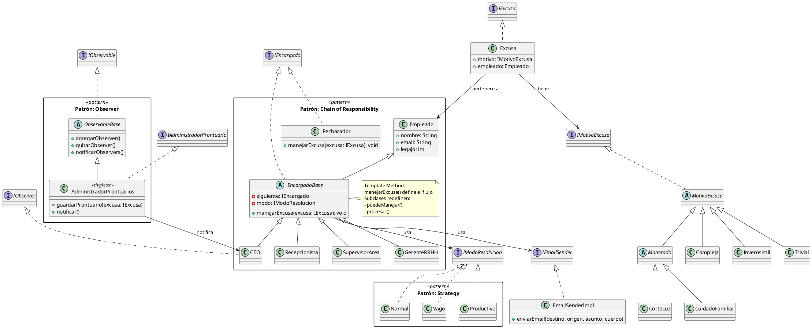

# Excusas S.A. - Sistema de Gestión de Excusas para Empleados

Este proyecto es una implementación en Java y Spring Boot de un sistema para la gestión de excusas presentadas por empleados. Aplica múltiples patrones de diseño orientado a objetos (OOP) y principios SOLID, y sigue una arquitectura limpia y modular.

---

## 📦 Estructura del Proyecto

```
src/
├── main/
│   ├── java/com/excusas/
│   │   ├── ExcusasSaApplication.java
│   │   ├── controller/
│   │   │   ├── ExcusaController.java
│   │   │   ├── EmpleadoController.java
│   │   │   ├── ProntuarioController.java
│   │   │   └── EncargadoController.java
│   │   ├── dto/
│   │   │   ├── ExcusaRequestDTO.java
│   │   │   ├── ExcusaResponseDTO.java
│   │   │   ├── EmpleadoRequestDTO.java
│   │   │   └── EmpleadoResponseDTO.java
│   │   ├── excepciones/
│   │   │   └──ExcusaNoManejadaException.java
│   │   ├── model/
│   │   │   ├── empleado/
│   │   │   │   ├── encargado/                
│   │   │   │   │   ├── EncargadoBase.java
│   │   │   │   │   ├── CEO.java
│   │   │   │   │   ├── Recepcionista.java
│   │   │   │   │   ├── SupervisorArea.java
│   │   │   │   │   ├── GerenteRRHH.java
│   │   │   │   │   ├── Rechazador.java
│   │   │   │   │   └── IEncargado.java
│   │   │   │   └── Empleado.java
│   │   │   └── estrategia/
│   │   │       ├── IModoResolucion.java
│   │   │       ├── Normal.java
│   │   │       ├── Vago.java
│   │   │       └── Productivo.java
│   │   ├── excusa/
│   │   │   ├── Excusa.java
│   │   │   ├── IExcusa.java
│   │   │   ├── Prontuario.java
│   │   │   └── motivo/
│   │   │       ├── IMotivoExcusa.java
│   │   │       ├── MotivoExcusa.java
│   │   │       ├── Trivial.java
│   │   │       ├── Moderada.java
│   │   │       ├── Compleja.java
│   │   │       ├── Inverosimil.java
│   │   │       ├── CorteLuz.java
│   │   │       └── CuidadoFamiliar.java
│   │   ├── observer/
│   │   │   ├── AdministradorProntuarios.java
│   │   │   ├── IObservable.java
│   │   │   └── IObserver.java
│   │   ├── procesamiento/
│   │   │   ├── encargado/
│   │   │   └── modo/
│   │   ├── repository/
│   │   │   ├── EmpleadoRepository.java
│   │   │   ├── ExcusaRepository.java
│   │   │   └── ProntuarioRepository.java
│   │   │
│   │   ├── service/
│   │   │   ├── ExcusaService.java 
│   │   │   ├── EmpleadoService.java
│   │   │   ├── ProntuarioService.java
│   │   │   ├── MotivoService.java
│   │   │   ├── ValidacionService.java
│   │   │   ├── EncargadoService.java
│   │   │   ├── IEmailSender.java
│   │   │   ├── LineaDeEncargados.java
│   │   │   └── EmailSenderImpl.java
├── test/
│   └── java/com/excusas/
│       ├── EmpleadoExcusasTest.java
│       ├── ExcusaincorrectaTest.java
│       ├── ModoResolucionTest.java
│       ├── RecepcionistaTest.java
│       ├── repository/
│       │   ├── EmpleadoRepositoryTest.java
│       │   ├── ExcusaRepositoryTest.java
│       │   └── ProntuarioRepositoryTest.java
│       ├── service/
│       │   ├── ExcusaServiceTest.java
│       │   ├── EmpleadoServiceTest.java
│       │   ├── ProntuarioServiceTest.java
│       │   ├── MotivoServiceTest.java
│       │   ├── ValidacionServiceTest.java
│       │   └── EncargadoServiceTest.java
│       ├── integration/
│       │   ├── ExcusaIntegrationTest.java
│       │   ├── NewEndpointsIntegrationTest.java
│       │   ├── PersistenceIntegrationTest.java
│       │   └── ServicesIntegrationTest.java
│       ├── validation/
│       │   └── NegocioValidationTest.java
│       └── excusas/
│           └── ExcusasSaApplicationTests.java
└── resources/
    └── application.properties
```

---

## 🧱 Patrones de Diseño Aplicados

### Chain of Responsibility

Se utilizó este patrón para modelar la cadena jerárquica que evalúa las excusas presentadas por los empleados. Cada encargado decide si puede resolver una excusa o si debe derivarla al siguiente nivel. Esto permite desacoplar el origen de la excusa de su resolución final.

**Participantes:**

- `Empleado`: genera la excusa.
- `Recepcionista`, `SupervisorArea`, `GerenteRRHH`, `CEO`: encargados que implementan la lógica de evaluación.
- `Rechazador`: cierra la cadena si nadie acepta la excusa.
- `EncargadoBase`: clase abstracta que contiene la lógica común de manejo.

Este diseño facilita la extensión futura del sistema, permitiendo agregar nuevos niveles jerárquicos o modificar la secuencia sin romper el resto del código.

---

### Strategy

Este patrón permite cambiar dinámicamente la forma en que un encargado procesa excusas. Se encapsulan diferentes “modos de resolución”, lo que permite alterar el comportamiento sin modificar la clase encargada.

**Participantes:**

- `IModoResolucion`: interfaz general de estrategias.
- `Normal`, `Vago`, `Productivo`: implementaciones concretas con diferentes comportamientos.

Gracias a este patrón, un mismo encargado puede actuar de distintas formas según el contexto o configuración, lo cual resulta útil para simular distintos perfiles o estilos de liderazgo.

---

### Observer

Se empleó este patrón para permitir que ciertos componentes reaccionen cuando una excusa es registrada. De esta forma, el sistema puede notificar a los observadores sin acoplar directamente el emisor con ellos.

**Participantes:**

- `IObservable`, `ObservableBase`: definen el comportamiento del sujeto observable.
- `AdministradorProntuarios`: observador central que guarda las excusas procesadas y notifica a los interesados.
- `CEO`: observador que recibe las notificaciones.

Este diseño permite que los encargados se concentren en procesar la excusa, mientras que la administración y seguimiento se maneja de forma separada y automática.

---

### Template Method

El patrón Template Method se aplicó para definir la estructura base del procesamiento de excusas, dejando que cada estrategia defina los pasos específicos que corresponden a su modo de operar.

**Participantes:**

- `EncargadoBase`: contiene el método `manejarExcusa`, que define la plantilla general del proceso.
- Cada estrategia (`Normal`, `Vago`, `Productivo`) determina los pasos personalizados dentro del método de resolución.

Esto permite mantener una lógica general para todos los encargados, a la vez que se respeta el principio de responsabilidad única para cada estrategia de resolución.

---

### Singleton

El patrón Singleton se aplicó en el `AdministradorProntuarios`, asegurando que exista una única instancia responsable de almacenar y notificar las excusas procesadas.

**Participante:**

- `AdministradorProntuarios`: clase única que centraliza el registro de excusas y la gestión de observadores.

Esta decisión garantiza consistencia en el almacenamiento de información y evita duplicación o pérdida de datos, especialmente útil en sistemas con múltiples fuentes de notificación.

---

## Diagrama de Clases


---

## 🏗️ Arquitectura del Sistema

### Capas de la Aplicación

#### **Controller Layer**
- `ExcusaController`: Maneja endpoints CRUD para excusas
- `EncargadoController`: Gestiona estado y configuración de encargados
- `ProntuarioController`: Proporciona acceso a registros históricos

#### **Service Layer**
- `ExcusaService`: Lógica de negocio para creación y procesamiento de excusas
- `EmpleadoService`: Gestión de empleados y validaciones
- `MotivoService`: Factory para creación de motivos de excusa
- `EncargadoService`: Administración de cadena de responsabilidad
- `ProntuarioService`: Manejo de registros históricos
- `ValidacionService`: Validaciones de datos de entrada

#### **Repository Layer**
- `ExcusaRepository`: Persistencia JPA con H2 para excusas
- `EmpleadoRepository`: Persistencia JPA con H2 para empleados  
- `ProntuarioRepository`: Persistencia JPA con H2 para prontuarios

#### **Model Layer**
- Entidades de dominio con lógica de negocio encapsulada
- Interfaces que definen contratos entre capas

---

## 🧠 Lógica del Sistema

### Flujo Principal de Procesamiento:

1. **Recepción**: El `ExcusaController` recibe una `ExcusaRequestDTO`
2. **Validación**: Se validan datos usando `ValidacionService`
3. **Creación de Entidades**:
  - Se busca o crea el empleado vía `EmpleadoService`
  - Se crea el motivo usando `MotivoService`
  - Se genera la excusa con `ExcusaService`
4. **Procesamiento**: La excusa pasa por la cadena de responsabilidad
5. **Persistencia**: Se guarda la excusa con su estado final
6. **Notificación**: Los observadores registran el resultado
7. Si nadie puede procesarla, la excusa se rechaza.

### Estados de Excusa:
- `PENDIENTE`: Excusa creada, esperando procesamiento
- `PROCESADA`: Excusa aceptada por algún encargado
- `RECHAZADA`: Excusa rechazada por toda la cadena

---

## 🔬 Testing

- Se utilizan tests unitarios con JUnit 5 para:
    - Empleados que generan excusas
    - Encargados que procesan excusas según el tipo
    - Modos de resolución
    - Casos límite como excusas inverosímiles

- Se incluyen tests de integración en `/test/com/excusas/ExcusaIntegrationTests.java` que prueban la API REST y su respuesta esperada.

---

## 🌐 API REST Completa

### 📋 **Endpoints Implementados**

#### **🎫 Excusas (8 endpoints)**
```http
# Crear nueva excusa
POST /api/excusas
Content-Type: application/json
{
  "empleadoNombre": "Juan Pérez",
  "empleadoEmail": "juan@empresa.com",
  "empleadoLegajo": 12345,
  "tipoMotivo": "trivial",
  "descripcion": "Llegué tarde por el tráfico"
}

# Obtener todas las excusas
GET /api/excusas

# Obtener excusa específica por ID
GET /api/excusas/{id}

# Obtener excusas por legajo de empleado
GET /api/excusas/legajo/{legajo}

# Obtener excusas por nombre de empleado
GET /api/excusas/empleado/{nombre}

# Búsqueda avanzada con filtros
GET /api/excusas/busqueda?legajo={legajo}&fechaDesde={fecha}&fechaHasta={fecha}

# Obtener solo excusas rechazadas
GET /api/excusas/rechazadas

# Eliminar excusas anteriores a fecha límite
DELETE /api/excusas/eliminar?fechaLimite={YYYY-MM-DD}
```

#### **👥 Empleados (3 endpoints)**
```http
# Obtener todos los empleados
GET /api/empleados

# Crear nuevo empleado
POST /api/empleados
Content-Type: application/json
{
  "nombre": "Ana García",
  "email": "ana@empresa.com",
  "legajo": 98765
}

# Obtener empleado por legajo
GET /api/empleados/{legajo}
```

#### **📋 Prontuarios (2 endpoints)**
```http
# Obtener todos los prontuarios
GET /api/prontuarios

# Obtener prontuarios por empleado
GET /api/prontuarios/empleado/{nombre}
```

#### **👔 Encargados (3 endpoints)**
```http
# Obtener configuración actual de la cadena
GET /api/encargados

# Agregar nuevo encargado dinámicamente
POST /api/encargados
Content-Type: application/json
{
  "nombre": "Coach Motivacional",
  "motivos": ["compleja", "inverosimil"]
}

# Cambiar modo de evaluación
PUT /api/encargados/modo
Content-Type: application/json
{
  "encargadoId": "jeremias",
  "nuevoModo": "PRODUCTIVO"
}
```

La persistencia es en memoria utilizando `List<>` y `Map<>`, lo que permite un almacenamiento temporal durante la ejecución

---
## 🔬 Testing Integral

Tests Unitarios
- Service Layer: Tests para toda la lógica de negocio
- Validation: Tests para validaciones de entrada
- Repository: Tests para persistencia en memoria

Tests de Integración
- API Endpoints: Tests completos de la API REST
- Service Integration: Tests que verifican interacción entre servicios
- Business Flow: Tests de flujos completos end-to-end

Cobertura de Testing
- Casos exitosos y de error
- Validaciones de datos
- Consistencia entre capas
- Comportamiento de patrones de diseño

---

## 🚀 Nuevas Funcionalidades Implementadas
### Gestión Completa de Empleados
- Creación automática de empleados en primera excusa
- Validaciones robustas de datos
- Búsqueda por legajo y nombre

### Sistema de Validaciones
- `ValidacionService` centraliza todas las validaciones
- Validación de emails, nombres, legajos y descripciones
- Mensajes de error descriptivos

### Administración de Encargados
- API para consultar estado de la cadena
- Cambio dinámico de modos de resolución
- Identificación de encargados por nombre

### Prontuarios Históricos
- Registro de todas las excusas procesadas
- Filtrado por empleado
- Separación entre excusas activas y históricas

### Manejo Robusto de Errores
- Excepciones personalizadas
- Validaciones en múltiples capas
- Respuestas HTTP apropiadas

---

## 🎯 Principios SOLID Aplicados
- **SRP** (Responsabilidad Única): Cada servicio tiene una responsabilidad específica
- **OCP** (Abierto/Cerrado): Extensible mediante nuevos motivos y estrategias
- **LSP** (Sustitución de Liskov): Interfaces respetadas por todas las implementaciones
- **ISP** (Segregación de Interfaces): Interfaces específicas y cohesivas
- **DIP** (Inversión de Dependencias): Dependencias mediante interfaces, no implementaciones

---

## 🎯 Objetivos

- Aplicar diseño orientado a objetos con patrones y principios SOLID.
- Simular un sistema empresarial de manejo de excusas con control jerárquico.
- Testear el comportamiento con unit tests.
- Exponer la lógica vía API REST para integrar frontend u otros sistemas.

---

## 🏁 Tags importantes

- `initial`: estructura del proyecto + modelos del parcial I
- `controller`: incluye capa REST y pruebas de integración
- `service`: lógica de negocio y pruebas de integración
- `final`: versión final con almacenamiento persistente y controladores funcionales
- **`repository`**: **✅ Capa Repository con persistencia JPA/H2 completamente implementada**

---

## 👨‍💻 Autor

- Alumnos:
  - Andrés Berillo
  - Juan Manuel Lukaszewicz
- Colaborador: @underabloodysky (profesor)
